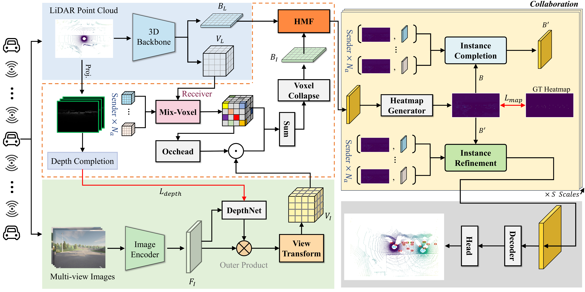
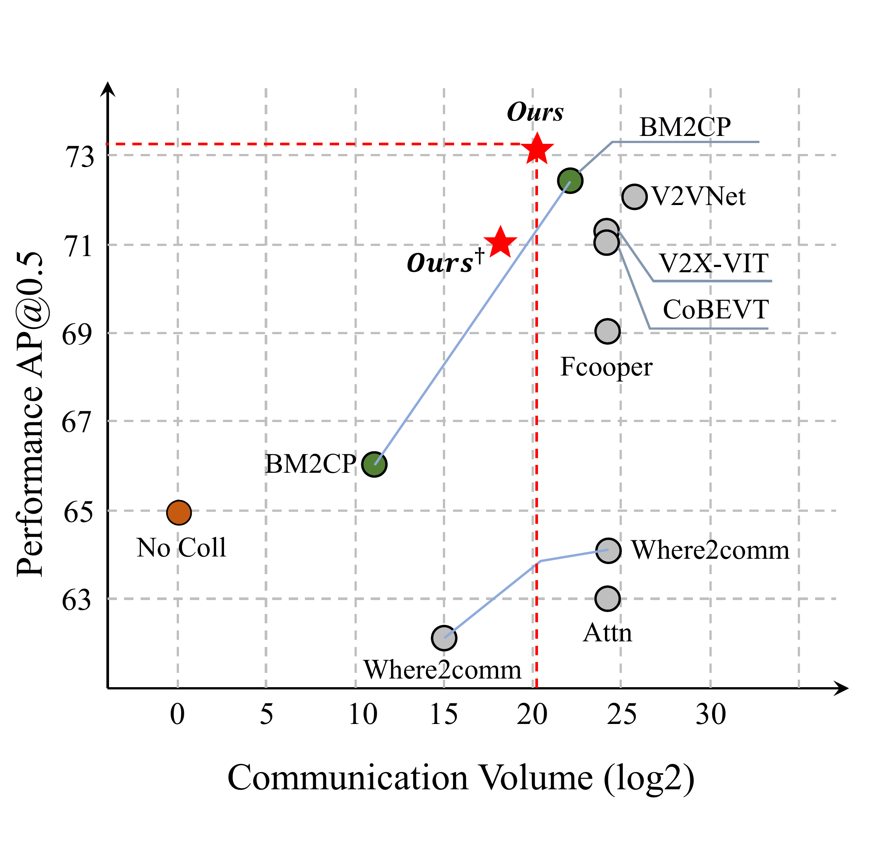

<div align="center">

# EIMC: Efficient Instance-aware Multi-modal Collaborative Perception

[](https://www.ieee-ras.org/conferences-workshops/fully-sponsored/icra)
[](https://www.python.org/)
[](https://pytorch.org/)
[](#license)



**EIMC** achieves state-of-the-art multi-modal collaborative 3D detection while reducing bandwidth by **87.98%** compared with the best published multi-modal collaborative detector.

[Paper](#citation) | [Getting Started](#installation)

</div>

## Highlights

- **Early Collaborative Paradigm**: Injects lightweight collaborative voxels into the ego's local modality-fusion step, yielding compact yet informative 3D collaborative priors.
- **Heatmap-driven Instance Communication**: Only Top-K instance vectors from low-confidence, high-discrepancy regions are queried from peers — drastically reducing redundancy.
- **Instance Completion & Refinement**: Cross-attention completion recovers occluded objects; self-attention refinement enhances instance features across agents.
- **87.98% Bandwidth Reduction**: Instance-centric messaging achieves superior performance with minimal communication overhead.

<div align="center">

</div>

## Results

### Multi-modal Collaborative Detection

| Method | OPV2V AP50 | OPV2V AP70 | DAIR-V2X AP50 | DAIR-V2X AP70 | Bandwidth (log2) |
|:---:|:---:|:---:|:---:|:---:|:---:|
| No Coll | 63.74 | 58.32 | 65.02 | 53.82 | 0.00 |
| V2VNet | 93.13 | 89.00 | 72.22 | 52.95 | 25.43 |
| V2X-ViT | 93.66 | 86.06 | 71.87 | 55.46 | 24.00 |
| CoBEVT | 93.03 | 84.64 | 71.70 | 55.85 | 24.00 |
| BM2CP | 93.04 | 88.94 | 72.37 | 56.18 | 23.18 |
| **EIMC** | **94.71** | **89.16** | **73.01** | **58.37** | **20.16** |

## Installation

This project is built upon the [HEAL](https://github.com/yifanlu0227/HEAL) framework.

### Step 1: Environment Setup

```bash
conda create -n eimc python=3.8
conda activate eimc
conda install pytorch==1.12.0 torchvision==0.13.0 torchaudio==0.12.0 cudatoolkit=11.6 -c pytorch -c conda-forge
pip install -r requirements.txt
python setup.py develop
```

### Step 2: Install Spconv

```bash
pip install spconv-cu116  # match your CUDA version
```

### Step 3: Compile CUDA Extensions

```bash
python opencood/utils/setup.py build_ext --inplace
```

## Data Preparation

Download and organize datasets under `dataset/`:

- **OPV2V**: [Download](https://github.com/DerrickXuNu/OpenCOOD)
- **DAIR-V2X**: [Download](https://thudair.baai.ac.cn/index) (with [complemented annotations](https://siheng-chen.github.io/dataset/dair-v2x-c-complemented/))

```
EIMC/dataset
├── OPV2V
│   ├── train
│   ├── validate
│   └── test
└── my_dair_v2x
    ├── v2x_c
    ├── v2x_i
    └── v2x_v
```

## Usage

### Training

```bash
# OPV2V
python opencood/tools/train.py -y opencood/hypes_yaml/opv2v/MM/DSfusion_V2.yaml

# DAIR-V2X
python opencood/tools/train.py -y opencood/hypes_yaml/dairv2x/MM/DSfusion_V2.yaml
```

### Evaluation

```bash
python opencood/tools/inference.py --model_dir ${CHECKPOINT_FOLDER} --fusion_method intermediate
```

## Citation

If you find this work useful, please cite:

```bibtex
@inproceedings{eimc2026icra,
  title={EIMC: Efficient Instance-aware Multi-modal Collaborative Perception},
  author={TODO},
  booktitle={IEEE International Conference on Robotics and Automation (ICRA)},
  year={2026}
}
```

## Acknowledgements

This project is built upon [HEAL](https://github.com/yifanlu0227/HEAL) and [OpenCOOD](https://github.com/DerrickXuNu/OpenCOOD). We thank the authors for their excellent work.

## License

This project is released under the [Academic Software License](LICENSE).
